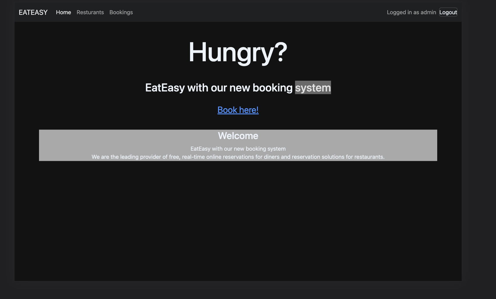
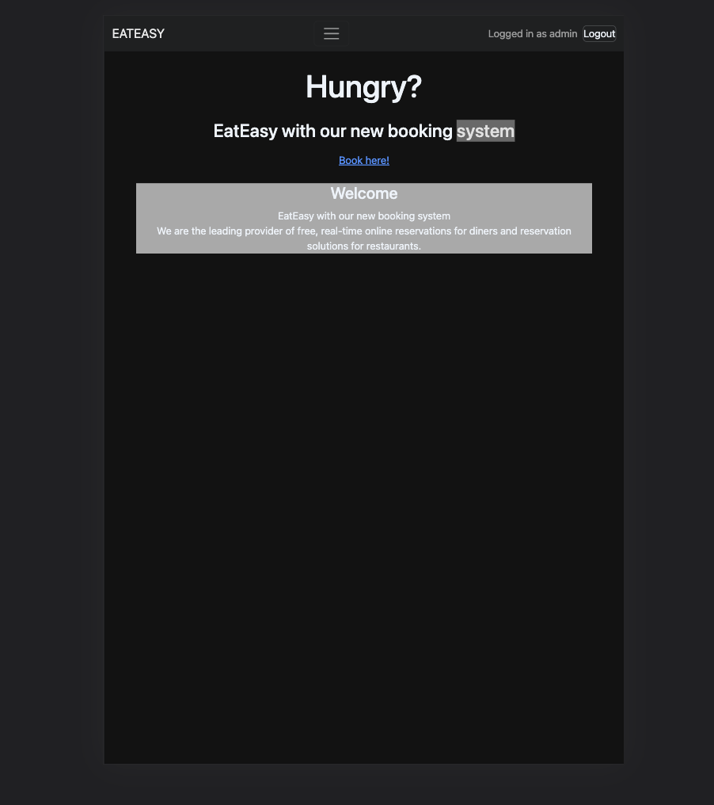
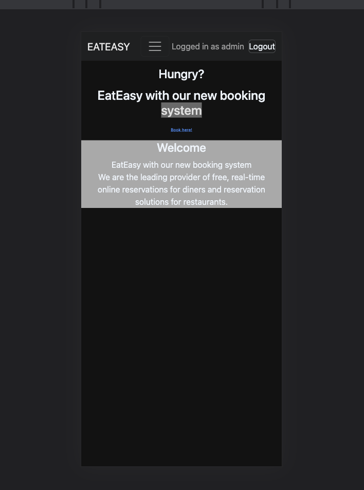
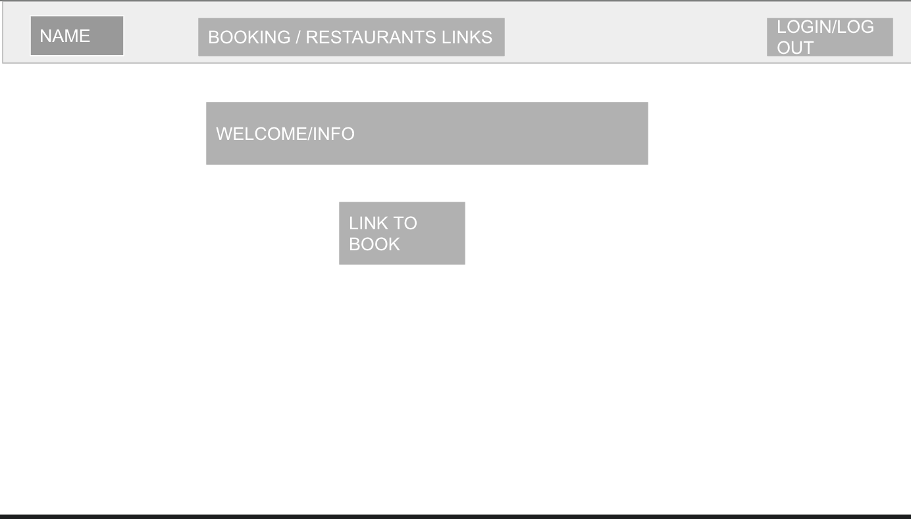
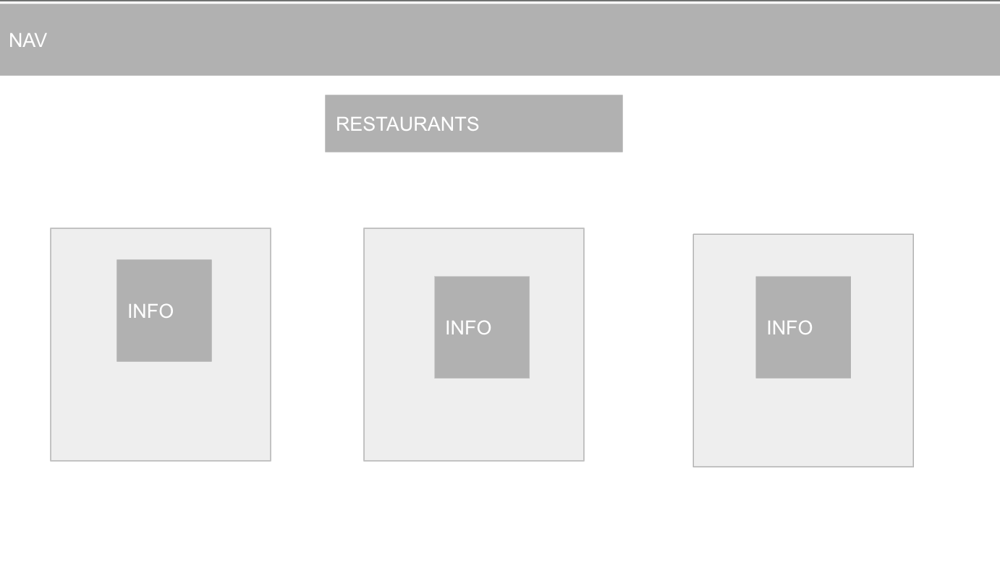
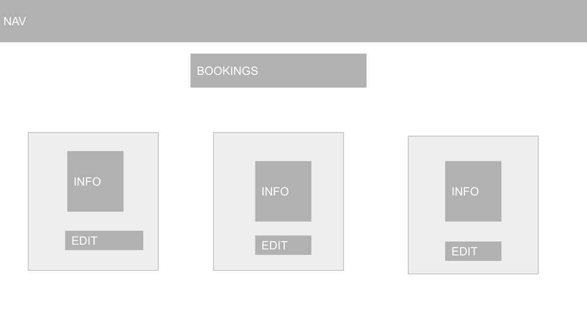
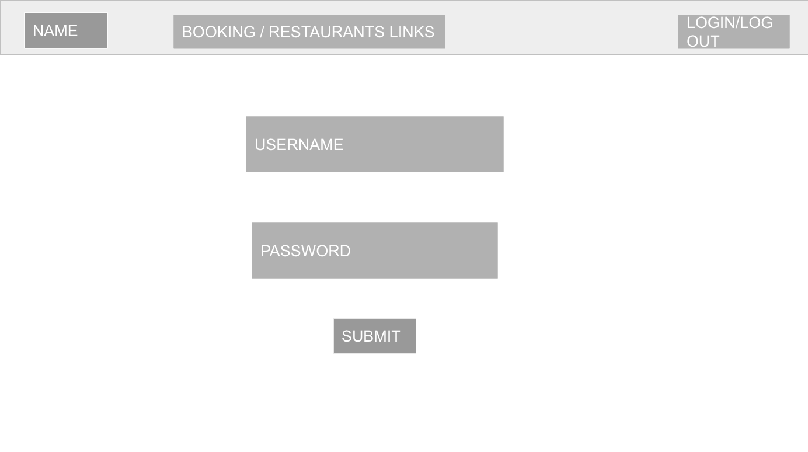
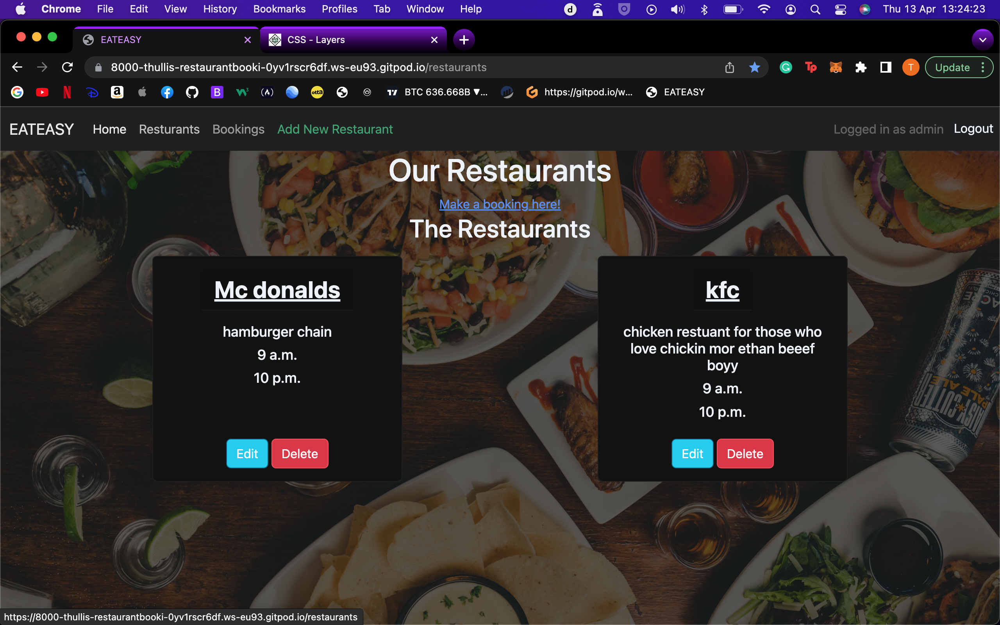
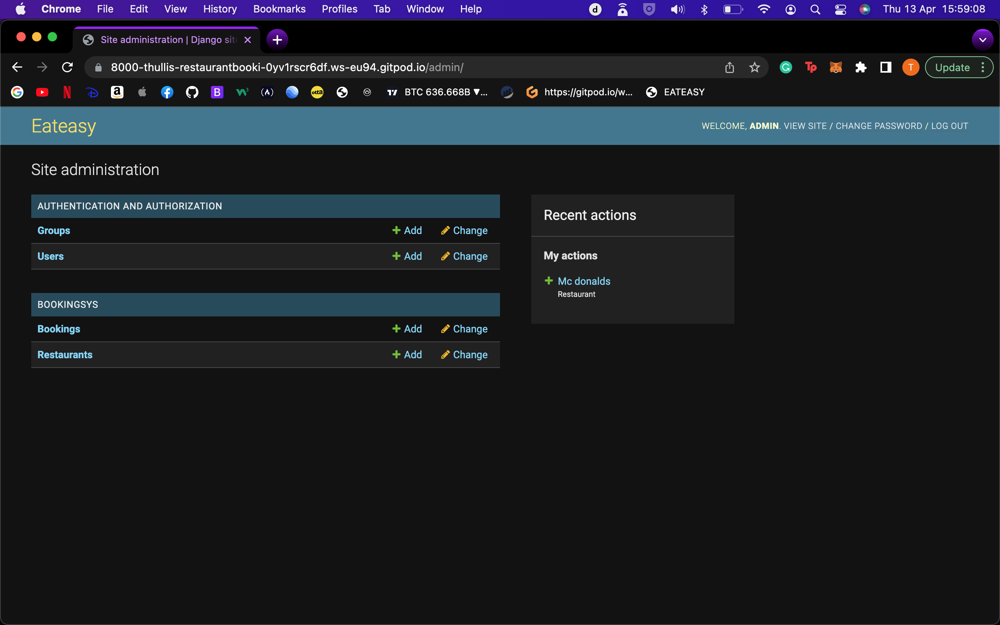

# Restaurant Booking System

Bookingsys is a python django web app for making resservations at restaurants.

## Abstract
This project was designed to streamline the booking procces for a chain of restaurants. All a users bookings can be seen in one place, with the capablity to create, read, edit and delete all the bookings. A user can only CRUD thier own bookings with no way of seeing other users bookings. The idea was to create a deliveroo style app but instead of making food orders, you simply can book seats.

## User Stories

**User Story [#3](https://github.com/t-hullis/Restaurant-Booking-System/issues/3):** 
As a customer, I can add a booking for a meal in a specific restaurant at a specific date/time, for a specific number of people

 **User Story [#2](https://github.com/t-hullis/Restaurant-Booking-System/issues/2):** As a site user I can select the date, time, party size and allergies so that I can customize the booking to suit my needs

 **User Story [#4](https://github.com/t-hullis/Restaurant-Booking-System/issues/4):** As a site user i can manage my booking so that reservations can be canceled, time/numbers can be changed

 **User Story [#5](https://github.com/t-hullis/Restaurant-Booking-System/issues/5):** As a Site user i can add an account for the website so that booking process is streamlined and can identify users

 **User Story [#6](https://github.com/t-hullis/Restaurant-Booking-System/issues/6):** As a restaurant owner/manager i can create a specific restaurant account so that my restaurant info can be displayed and integrated into the app, for users to use

 **User Story [#8](https://github.com/t-hullis/Restaurant-Booking-System/issues/8):** As a site user i can view a page or card/widget about each restaurant so that users can get information like location, opening hours, dietary requirements, etc ..

 **User Story [#10](https://github.com/t-hullis/Restaurant-Booking-System/issues/10):** As a user i can not double book a table in a restaurant so that i can be sure to get a table when i book one

 **User Story [#11](https://github.com/t-hullis/Restaurant-Booking-System/issues/11):** As a user i can view all my bookings so that it is easy to view and manage my bookings

# UX

## User
- Nav Bar : The nav bar spans all of the pages of this website and allows you to got to the restaurant page and bookings page easily. It also has a button on right, which depending on the login status of the user, will change from login to logout.

- Home page : The front end of this website is very simple. The text is ment to grab the users atention then move them straight through to the booking page with minimal distraction.  

- Design : 

- Restaurant page : The user is met by cards diplaying the current restaurants you are able to book on the app. Links to Bookings page can be found. The cards diplay the name of the restaurant, a desription, as well was their opening times and closing times.

- Design : 

- Bookings page :  This page has a similar set up to to the restaurants page but it has the added functionality of the user being able to update/edit and delete bookings which belong to them.

- Design :

- Forms : For the forms i have used the cripsy forms library. This streamlined the form making process and added in error handling. 

- Design :

## Admin

-  The superuser (restaurant owner/manager) can add new retaurants to the database specifying restaurant detailsin the page that is link added to the nav bar, only avaible to the superuser, which takes them to a page form where they can add a new restuarant to the website for costomers to book.

- The admin can also access the conrol panel for where he/she can manage restaurants and bookings directly. All CRUD functions for the project can be accessed from here. 

## Autherisation
In order to access your bookings, text decorators have been used, so you have to be logged in. This can be seen in views.py. The booking view stops other users from being able to see your bookings by onoly showing the booking with the same user id as current user.

## Databases

All my databases have been created using django and postgres. 

- Restaurants : This is a model for the data of the restaurants. it holds opening times, closing times as well as a description and the name. This data can be diplayed.

- Bookings : Specifies booking start time, party size and extra info. It also has two forign keys which link it to the user model as well as Restruant models, so the bookings can be specifed to an exact restaurant.

# Testing

- testing has been done to make sure invalid forms are rejected, all tests pass

- testing has been done to make sure correct form secontions are running in form

- documentaion can be found in testing.md

# Deployment

The master branch of this repository has been used for the deployed version of this application.

### Using Github & Gitpod

To deploy my Django application, I had to use the [Code Institute Python Essentials Template](https://github.com/Code-Institute-Org/python-essentials-template).

- Click the `Use This Template` button.
- Add a repository name and brief description.
- Click the `Create Repository from Template` to create your repository.
- To create a Gitpod workspace you then need to click `Gitpod`, this can take a few minutes.
- When you want to work on the project it is best to open the workspace from Gitpod (rather than Github) as this will open your previous workspace rather than creating a new one. You should pin the workspace so that it isn't deleted.
-  Committing your work should be done often and should have clear/explanatory messages, use the following commands to make your commits:
    - `git add .`: adds all modified files to a staging area
    - `git commit -m "A message explaining your commit"`: commits all changes to a local repository.
    - `git push`: pushes all your committed changes to your Github repository.

*Forking the GitHub Repository*

If you want to make changes to your repository without affecting it, you can make a copy of it by 'Forking' it. This ensures your original repository remains unchanged.

1. Find the relevant GitHub repository
2. In the top right corner of the page, click the Fork button (under your account)
3. Your repository has now been 'Forked' and you have a copy to work on

*Cloning the GitHub Repository*

Cloning your repository will allow you to download a local version of the repository to be worked on. Cloning can also be a great way to backup your work.

1. Find the relevant GitHub repository
2. Press the arrow on the Code button
3. Copy the link that is shown in the drop-down
4. Now open Gitpod & select the directory location where you would like the clone created
5. In the terminal type 'git clone' & then paste the link you copied in GitHub
6. Press enter and your local clone will be created.

### Creating an Application with Heroku

I followed the below steps using the Code Institute tutorial and [Django Blog cheatsheat](https://codeinstitute.s3.amazonaws.com/fst/Django%20Blog%20Cheat%20Sheet%20v1.pdf)

- The following command in the Gitpod CLI will create the relevant files needed for Heroku to install your project dependencies `pip3 freeze --local > requirements.txt`. Please note this file should be added to a .gitignore file to prevent the file from being committed. A `Procfile` is also required that specifies the commands that are executed by the app on startup. 

1. Go to [Heroku.com](https://dashboard.heroku.com/apps) and log in; if you do not already have an account then you will need to create one.
2. Click the `New` dropdown and select `Create New App`.
3. Enter a name for your new project, all Heroku apps need to have a unique name, you will be prompted if you need to change it.
4. Select the region you are working in.

*Heroku Settings*
You will need to set your Environment Variables - this is a key step to ensuring your application is deployed properly.
- In the Settings tab, click on `Reveal Config Vars` and set the following variables:
    - SECRET_KEY - to be set to your chosen key
    - CLOUDINARY_URL - to be set to your Cloudinary API environment variable
- In the resources tab you must install 'Heroku Postgres'

*Heroku Deployment*
In the Deploy tab:
1. Connect your Heroku account to your Github Repository following these steps:
    1. Click on the `Deploy` tab and choose `Github-Connect to Github`.
    2. Enter the GitHub repository name and click on `Search`.
    3. Choose the correct repository for your application and click on `Connect`.
2. You can then choose to deploy the project manually or automatically, automatic deployment will generate a new application every time you push a change to Github, whereas manual deployment requires you to push the `Deploy Branch` button whenever you want a change made.
3. Once you have chosen your deployment method and have clicked `Deploy Branch` your application will be built and you should see the below `View` button, click this to open your application:

## Technologies Used
 
This project has been deoplyed on heroku.

- [Django](https://www.djangoproject.com/)
    -  Framework used to build the project.
- [Python](https://www.python.org/)
- [Bootstrap](https://getbootstrap.com/)
    - Makes mobile first responsive design.
- [GitHub](https://github.com/)
    - Holds and stores project.
- [Gitpod](https://www.gitpod.io/)
    - Development environment.
- [Heroku](https://dashboard.heroku.com/apps)
    - App deployed here.
- Crispy forms

# Bugs
- The form to update a booking wouldnt pre load exsiting data into it. this was solved by adding an edit view into views.py and taking instance data.
- Current bug where heroku wont load my style sheet. I spent over 8 hours with the tutor trying to fix it but they were unable to help, so if you want to see my project properly please run on live server.
- There was a bug where anyone could edit anyone elses bookings, this was fixed by in views by adding a check to see which user is trying to change their booking before they can
