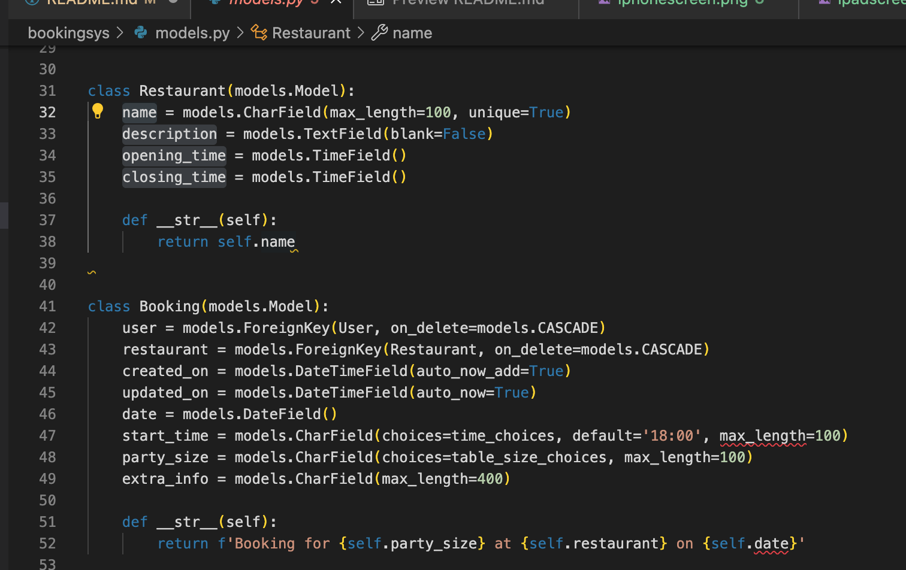

# Restaurant Booking System

Bookingsys is a python django web app for making resservations at restaurants.

## Abstract
This project was designed to streamline the booking procces for a chain of restaurants. All a users bookings can be seen in one place, with the capablity to create read, edit and delete all the bookings. A user can only CRUD thier own bookings with no way of seeing other users bookings. The idea was to create a deliveroo style app but instead of making food orders, you simply can book seats.

## User Stories

| **User Story [#1](https://github.com/t-hullis/Restaurant-Booking-System/issues/1):** 
As a customer, I can add a booking for a meal in a specific restaurant at a specific date/time, for a specific number of people

 **User Story [#2](https://github.com/t-hullis/Restaurant-Booking-System/issues/2):** As a site user I can select the date, time, party size and allergies so that I can customize the booking to suit my needs

 **User Story 003:** 
 **User Story 004:** 
 **User Story 005:**
 **User Story 006:** 
 **User Story 007:** 
| **User Story 008:** As a site user I want to be able to delete bookings I no longer need. | Ability to manage own bookings |
| **User Story 009:** As a site user I want to be able to amend the timing of my booking. | Ability to manage own bookings |
| **User Story 010:** As a site owner I want to be able to manage the escape room information to ensure it is up to date. | Attract potential customers |
| **User Story 011:** As a site owner I want to be able to manage bookings for the escape room in order to plan for upcoming customers. | Manage customer bookings |
| **User Story 012:** As a site owner I want to be able to manage and view contact requests so that relevant action can be taken. | Manage contact requests |
# UX
## User

- Home page : The front end of this website is very simple. The user is met by the home page which tells them the purpose of the page direts them to the bookings page. The nav bar allows you to got to the restaurant page and bookings page. It also has a button in the top right corner, which depending on the login status of the user, will change from login to logout. Next to the button is one text which diplays the login status of the current user
- Restaurant page : The user is met by cards diplaying the current restaurants opperation on the app. Link to Bookings page can be found. The cards diplay the name of the restaurant, a desription, as well was their opening times and closing times.
- Bookings page :  This page has a similar set up to to the bookings page but it has the added functionality of the user being able to update and delete bookings which belong to them.
- forms : for the forms i have used the cripsy forms library. this streamlined the form making prcess and added in error handling. 

## Admin

- In admin, the superuser (restaurant owner/manager) can add new retaurants to the database specifying restaurant details.

## Autherisation
In order to access your bookings, text decorators have been used, so you have to be logged in. This can be seen in views.py. The booking view stops other users from being able to see your bookings by onoly showing the booking with the same user id as current user.

## Databases

All my databases have been created using django and postgres. 

- Restaurants : This is a model for the data of the restaurants. it holds opening times, closing times as well as a description and the name. This data can be diplayed.

- Bookings : Specifies booking start time, party size and extra info. It also has two forign keys which link it to the user model as well as Restruant models, so the bookings can be specifed to an exact restaurant.

# Testing

- testing has been done to make sure invalid forms are rejected, all tests pass

- testing has been done to make sure correct form secontions are running in form

# Deployment
## Technologies Used
 
This project has been deoplyed on heroku.

- [Django](https://www.djangoproject.com/)
    -  Framework used to build the project.
- [Python](https://www.python.org/)
- [Bootstrap](https://getbootstrap.com/)
    - Makes mobile first responsive design.
- [GitHub](https://github.com/)
    - Holds and stores project.
- [Gitpod](https://www.gitpod.io/)
    - Development environment.
- [Heroku](https://dashboard.heroku.com/apps)
    - App deployed here.
- Crispy forms

# Bugs
- The form to update a booking wouldnt pre load exsiting data into it. this was solved by adding an edit view into views.py and taking instance data.

- 

