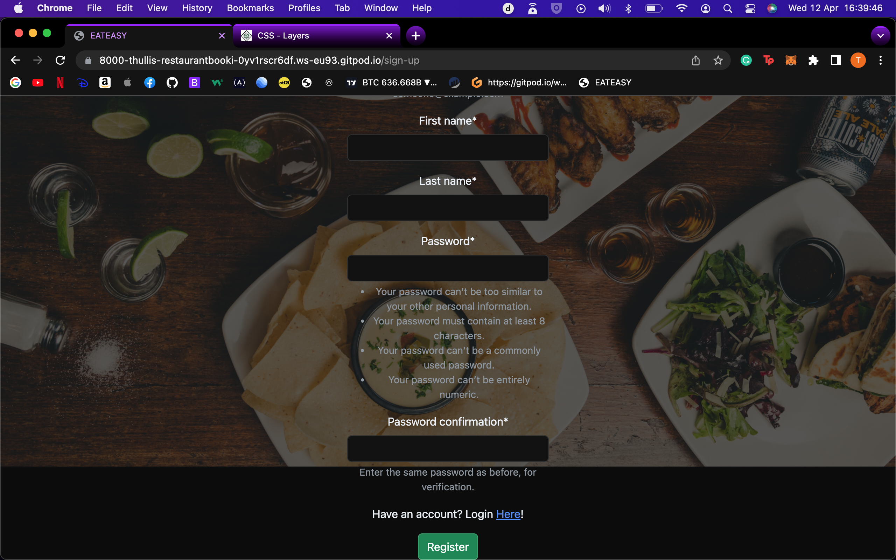

# Testing

## User Stories

**User Story [#3](https://github.com/t-hullis/Restaurant-Booking-System/issues/3):** 
As a customer, I can add a booking for a meal in a specific restaurant at a specific date and time, for a specific number of people

 **User Story [#2](https://github.com/t-hullis/Restaurant-Booking-System/issues/2):** As a site user I can select the date, time, party size and allergies so that I can customize the booking to suit my needs
 

 **User Story [#4](https://github.com/t-hullis/Restaurant-Booking-System/issues/4):** As a site user i can manage my booking so that reservations can be canceled, time/numbers can be changed
 
 

 **User Story [#5](https://github.com/t-hullis/Restaurant-Booking-System/issues/5):** As a Site user i can add an account for the website so that booking process is streamlined and can identify users
 
 
 

 **User Story [#6](https://github.com/t-hullis/Restaurant-Booking-System/issues/6):** As a restaurant owner/manager i can create a specific restaurant account so that my restaurant info can be displayed and integrated into the app, for users to use

 **User Story [#8](https://github.com/t-hullis/Restaurant-Booking-System/issues/8):** As a site user i can view a page or card/widget about each restaurant so that users can get information like location, opening hours, dietary requirements, etc ...
 

 **User Story [#10](https://github.com/t-hullis/Restaurant-Booking-System/issues/10):** As a user i 77j
 **User Story [#11](https://github.com/t-hullis/Restaurant-Booking-System/issues/11):** As a user i can view all my bookings so that it is easy to view and manage my bookings

